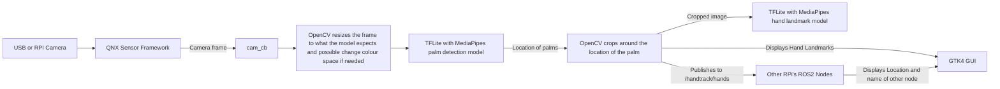
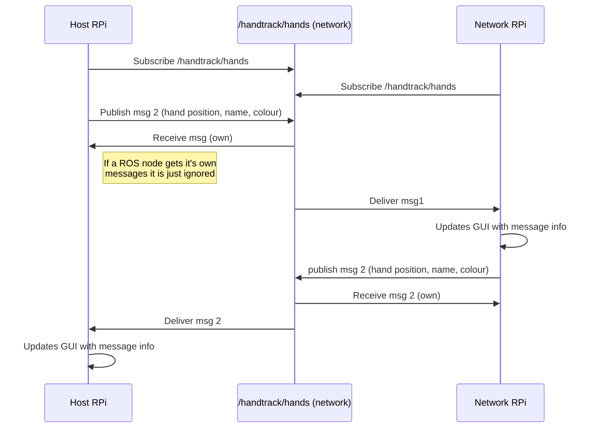

# TFLite Handtrack

Native QNX hand-landmark tracking with sensor framework and TFLite.

## Prerequisite
### Build and Runtime Dependencies
In order to build the project a few dependencies need to be installed in order to support building on the target. in order to install dependencies run the provided `configure.sh` script. This script should be used instead of installing the dependencies themselves as during workshop the /boot will be prefetched with everything you need.
```bash
./configure.sh
```

### Camera
> For RPI5 QSTI starting in 8.0.5 multiple camera unit have been exposed in a single running Sensor Framework instance making this step unneeded
A camera must be configured through sensor framework for this demo.

The demo has been verified with the RPI Camera Module 3 and Logitech C270 USB camera. By default camera unit 5 will be used but this can be changed with CLI options.

#### QSTI 8.0.5 and on
Depending on which camera you are using when running you will need to specific a different unit where the numbers have been provided below

##### RPI5
- rpi-camera CAM/DISP 0 - unit 3
- rpi-camera CAM/DISP 1 - unit 4
- usb-camera            - unit 5

##### RPI4
- rpi-camera - unit 3
- usb-camera - unit 4

#### QSTI 8.0.4 and before
Update /etc/startup/post_start.sh to start `sensor` with the correct camera configuration.

### Models

MediaPipe's hand landmarking lite Task is used for hand landmarking. This is split into 2 models (palm_detection_lite.tflite and hand_landmark_lite.tflite). The first model will detect palm in the screen, and the second will take a ROI from the first and detect the landmarks for every hand on the screen. These will automatically be downloaded during the build process so you do not need to fetch them yourself.

All the required configuration for the model
```sh
./start.sh --ros-args -p det_th:=0.8 -p presence_th:=0.6
```

| parameter        | default                             | what it does                                                                                        |
| ---------------- | ----------------------------------- | --------------------------------------------------------------------------------------------------- |
| `det_th`         | 0.7                                 | palm-detector confidence: drops weak palm boxes before any crop work                                |
| `presence_th`    | 0.5                                 | landmark presence: rejects a confident-but-wrong box once the landmark model has looked at the crop |
| `track_scale`    | 2.0                                 | how much the crop derived from the previous frame's landmarks is padded                             |
| `tracking`       | true                                | skip the palm detector while a hand stays tracked; `false` detects every frame                      |
| `redetect_every` | 15                                  | frames between detector sweeps while short of `max_hands`                                           |
| `mirror`         | false                               | set if your feed is mirrored, or if left/right come out backwards                                   |
| `threads`        | 3                                   | TFLite interpreter threads                                                                          |
| `det_model`      | `models/palm_detection_lite.tflite` | palm detector, relative to the package share directory                                              |
| `lm_model`       | `models/hand_landmark_lite.tflite`  | landmark model, same                                                                                |

Detection is gated twice, by `det_th` then `presence_th`. The second is the
stronger gate. a clean hand scores ~0.99. Ranges
and the reasoning behind each default are in `HandTrackConfig` in
[handtracking.hpp](handtracking.hpp); `camera_unit` is the node's own, see
[Running the demo](#running-the-demo).

## Overlay

When started a GTK4 application will startup showing the video feed and overlay point on the screen based on the input from the ML.

There are 2 source which can be overlaid:

- **Your hands**, from the local ML models the full 21-point hand landmark will be displayed with a bounding box as well as, a custom label, confidence source, and handedness. The colour hand label can be changed by following [Next Steps](#next-steps).
- **Visitors**, Every other ros2 node will act as a edge mess publishing their results over the network to other interest parties. If a visitor disconnects for more than 3 seconds the point will be removed.

## Build
> Before running the build script ./configure.sh should be run to install all dependencies.

A build script has been provided to make building easier but really all it is doing is sourcing the installed ROS2 install and running `colcon build`. For more information about how the build works see `build.sh`
```sh
./build.sh
```

## Running the demo
> When running you may need to specify the camera unit using the following.
```sh
./start.sh --ros-args -p camera_unit:=5
```

## Next steps
Once you have the demo running in handtrack_gui.hpp you can change the colour and label which displays on the screen. After this rebuild the project to see the changes

For example I might change it to Larry and Green because it is my favourite colour
```cpp
inline constexpr const char* MY_LABEL = "Larry";
inline const cv::Scalar MY_COLOUR{0, 255, 0};  // BGR
```

# Design Diagram

## ML Workflow
To process the ML we use 2 TFLite Models from MediaPipes hand Landmark task. The first model will find palms on the screen while the second actually finds the hand landmarks. The diagram below shows how the data will move all the way from the USB Camera to be displayed on the screen


## ROS2 Nodes
All RPis on the network will subscribe and publish to the same message allowing for cross communication for anything on the same subnet. Whenever new ML results are received it will be relayed over the network on /handtrack/hands with a message containing the location of the center of the hand, chosen label, and chosen colour. A interaction between 2 RPis.

